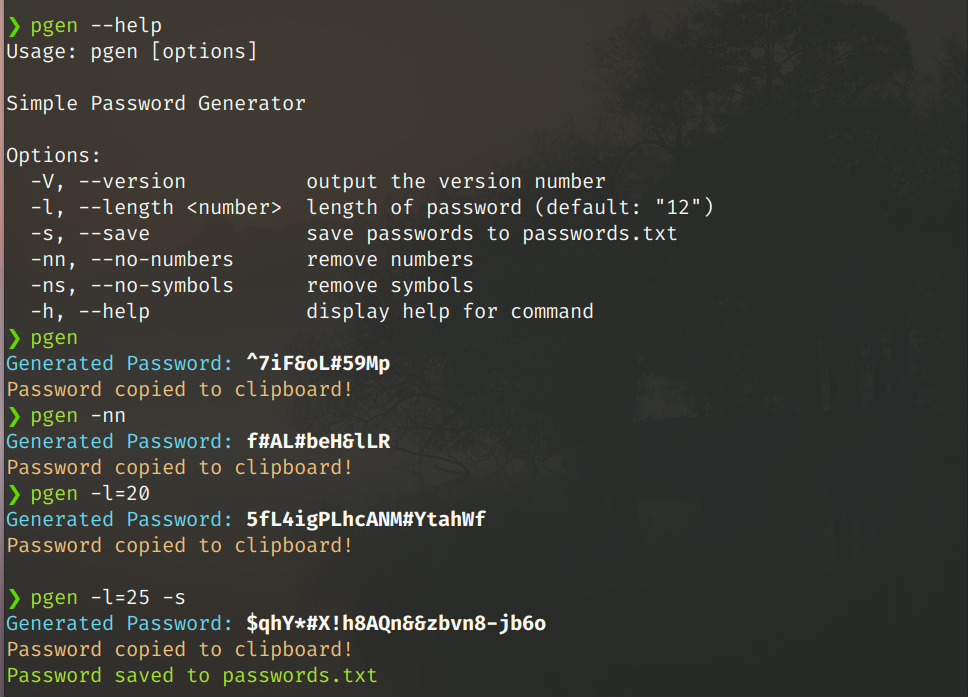

# PGEN

### Simple CL password generator in NodeJS



## Commands

| Command                   | Function                         |
| ------------------------- | -------------------------------- |
| -V, --version             | output the version number        |
| -l , --length \<numbers\> | length of password (default: 12) |
| -s, --save                | save passwords to passwords.txt  |
| -nn, --no-numbers         | remove numbers                   |
| -ns, --no-symbols         | remove symbols                   |
| -h , --help               | display help for command         |

## How it works

1. Should have [NodeJS](https://nodejs.org/) in your system.
2. Download this repository.
3. Go inside this repository and open in terminal.
4. Run the command below:
   ```
   npm i && npm link
   ```

### Run `pgen` in terminal and see the magic
